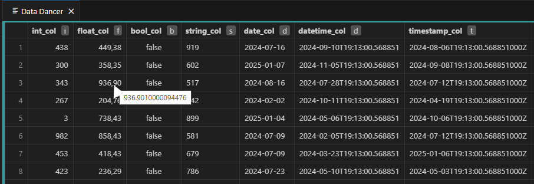

# Data Dancer - Samples 

## Data Dancer - Big Query in Visual Studio Code

Execute, analyze and model Big Query SQL within Visual Studio Code.

## Features

### Environment aware
* Switch effortlessly between your datasets or environments
* Colorize your environments


### Variables
* Simple and powerful variable handling
* Substitute datasets, variables or settings depending on environment
* Variable highlighting


### Execute Sql
* Run selected text or the full .sql file. 
* Output to Data Dancer result window inside Visual Studio Code
* Investigate results without leaving Visual Studio Code
* Shows actual billed cost

### Analyze Sql
* Dry-run: Get cost estimation from Big Query before running it

### Copy Sql
* Copies the selected sql into clipboard. Substituting variables on the fly


### Data Analysis
* Quick data type insights
* Investigate returning schema
* Investigate returning raw json


### Other features
#### Type formatting



#### Clipboard Integration
* Copy data from Data Dancer's result window on mouse click
* Quickly paste your tabular result to excel


## Requirements

You need a [Google Cloud Big Query](https://cloud.google.com/bigquery) Account


## Getting started

### Create environment file
Create your environment json file.
Create variables for your environment. Usually one for each dataset.

Sample `dev.json` 
```
{
	"settings":
	{
		"project-id":"your-gcp-project",
		"location":"europe-north1",
		"color":"rgba(102, 153, 53, 0.5)" 
	},
	"variables":
	{
		"@@bronze":"dev_bronze",
		"@@silver":"dev_silver",
		"@@gold": "dev_gold",
        "var-raw-data-import-cutoff-months": "24"
	}
}
```

Sample `dev_john.json` 
Notice the inheritance. Where John changed gui color and dataset names.
```
{
    "inherits" : "dev.json",
	"settings":
	{
		"color":"rgba(100, 100, 100, 0.5)" 
	},
	"variables":
	{
		"@@bronze":"john_dev_bronze",
		"@@silver":"john_dev_silver",
		"@@gold":"jon_dev_gold"
	}
}
```

### Switch between environments
Right click your .json file and choose "Use as Environment file"
or click Data Dancer heart icon at bottom right of Visual Studio Code


## Known Issues
* No hard-coded limit for returning result. May cause issues if you select large amounts of rows


